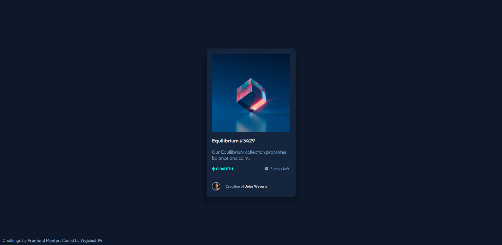

# Frontend Mentor - NFT preview card component solution

This is a solution to the [NFT preview card component challenge on Frontend Mentor](https://www.frontendmentor.io/challenges/nft-preview-card-component-SbdUL_w0U).

## Table of contents

- [Overview](#overview)
  - [Screenshot](#screenshot)
  - [Links](#links)
- [Author](#author)
- [My process](#my-process)
  - [Built with](#built-with)
  - [What I learned](#what-i-learned)

## Overview

### The challenge

Users should be able to:

- View the optimal layout depending on their device's screen size
- See hover states for interactive elements

### Screenshot

### Links

- Solution URL: [Solution URL](https://github.com/wojciech94/NFT-Card-Preview)
- Live Site URL: [Live site URL](https://wojciech94.github.io/NFT-Card-Preview/)

## Author

- Website - [Wojciech94](https://github.com/wojciech94)
- Frontend Mentor - [@wojciech94](https://www.frontendmentor.io/profile/wojciech94)

## My process

### Built with

- Semantic HTML5 markup
- CSS
- SCSS
- Flexbox

### What I learned

In this project:

- I repeated knowledge of preparing responsive and stilized card,
- I learned how to use double box shadows
